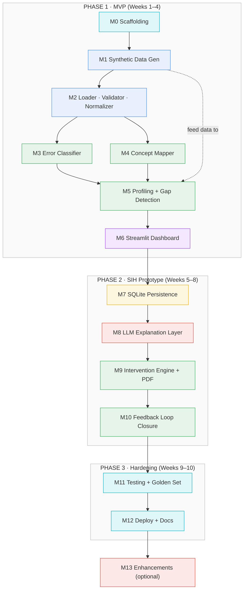

# SHIKSHA RADAR — Project Modularity

## Dependency Graph



## Rules of Modularity

1. **One module = one work block (2–4 h)** → one verifiable check → one commit.
2. **Dependency only**: a module may use only the modules it depends on (edge in graph) — nothing else.
3. **Fork = parallel**: `M3` and `M4` both branch from `M2` and can be built by different people in parallel.
4. **Phase boundary = milestone**: finish Phase 1 → you have a working MVP demo; Phase 2 → SIH-ready prototype; Phase 3 → deployable.
5. **M11 rides along**: tests are written *with* every module, not after.

## Quick Reference

| Module | What it does | Produces | Phase |
|--------|--------------|----------|-------|
| M0 | Repo, venv, config | runnable skeleton | 1 |
| M1 | NCERT-aligned fake student data | 4 CSVs, 6 archetypes | 1 |
| M2 | CSV import + validation + answer cleanup | clean DataFrames | 1 |
| M3 | Rule-based error type classification | error_type per answer | 1 |
| M4 | Question → concept mapping (rule + embedding) | concept per question | 1 |
| M5 | Wilson confidence, trends, learning gaps | ConceptProfile + LearningGap | 1 |
| M6 | 4-view teacher dashboard | interactive app | 1 |
| M7 | Persistent storage + multi-assessment | SQLite DB | 2 |
| M8 | Evidence-cited, hallucination-guarded explanations | teacher-friendly text | 2 |
| M9 | Targeted worksheets + PDF export | intervention PDF | 2 |
| M10 | Reassess → compare → improved/persisted | closed loop | 2 |
| M11 | Golden set + eval + CI | green test suite | 3 |
| M12 | Streamlit Cloud deploy + docs | public URL | 3 |
| M13 | i18n, class report, embedding fallback | extras | post-SIH |

## ASCII Fallback

```
P1 MVP ──────────────── P2 SIH Prototype ──────── P3 Hardening
M0 → M1 → M2 ┬→ M3 ─┐
             └→ M4 ─┤→ M5 → M6 → M7 → M8 → M9 → M10 → M11 → M12 → M13
                  (M3/M4 run in parallel)
```
